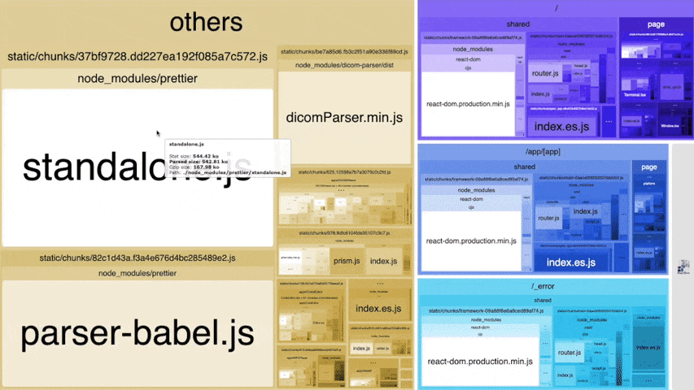

# Next Bundle Analyzer

## Motivation

[Webpack Bundle Analyzer](https://github.com/webpack-contrib/webpack-bundle-analyzer)
is a great tool to analyze the bundles of web applications built on top of
[Webpack](https://github.com/webpack/webpack) but trying to use it to optimize a
large website with many pages can be tricky because you don't know which pages
the different chunks belong to.

There is an official wrapper dedicated to Next.js,
[@next/bundle-analyzer](https://github.com/vercel/next.js/tree/canary/packages/next-bundle-analyzer),
but it only allows (for now) to generate standard reports for the server and
client builds of Next.

This library generates customized Webpack Bundle Analyzer reports in order to
make them easier to use for Next users.



## Installation

We recommend installing `next-bundle-analyzer` as dev dependency:

```bash
npm install -D next-bundle-analyzer
```

or

```bash
yarn add -D next-bundle-analyzer
```

## Usage

```js
// next.config.js

const shouldAnalyzeBundles = process.env.ANALYZE === true;

let nextConfig = {
  // [...]
};

if (shouldAnalyzeBundles) {
  const withNextBundleAnalyzer =
    require('next-bundle-analyzer')(/* options come there */);
  nextConfig = withNextBundleAnalyzer(nextConfig);
}

module.exports = nextConfig;
```

⚠️ If `next-bundle-analyzer` has been installed as dev dependency, itshould be
required conditionally to prevent breaking Next.js in production.

## Options

| Option         | Values                                               | Default                                                                                         | Description                                                                           |
| -------------- | ---------------------------------------------------- | ----------------------------------------------------------------------------------------------- | ------------------------------------------------------------------------------------- |
| clientOnly     | `true` `false`                                       | `true`                                                                                          | When `true`, generate only a report for client side build.                            |
| enabled        | `true` `false`                                       | `true`                                                                                          | Allows to enable/disable the plugin.                                                  |
| format         | `'html'` `'json'` <code>['html',&nbsp;'json']</code> | `'html'`                                                                                        | The format of the report(s) to generate. It can be a single format or a list.         |
| openHtmlReport | `true` `false`                                       | `true`                                                                                          | When `true`, report opens automatically once generated.                               |
| reportDir      | `string`                                             | `'analyze'`                                                                                     | Name of the directory that will contain the reports. Relative to Webpack output path. |
| reportFilename | `string`                                             | `'bundles'`<br><br>`'-client'` and `'-server'` suffixes will be added if `clientOnly` is false. | Name of the report without the extension.                                             |
